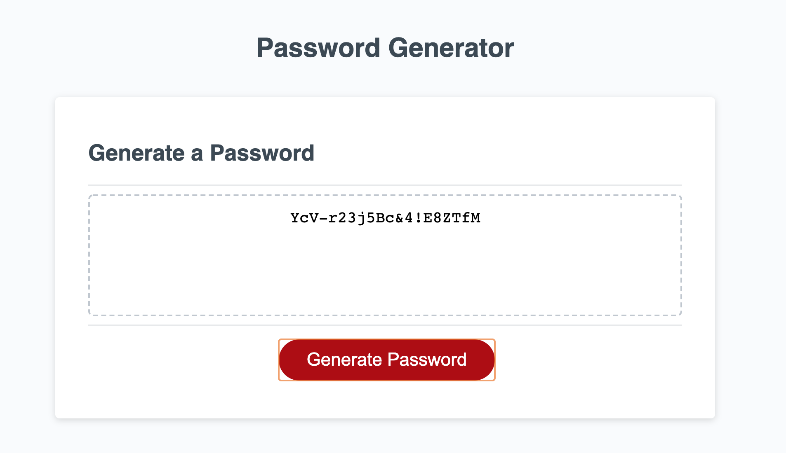

# Password Generator

## Overview
This applicaton creates a random password based on criteria that the user specifies. The user must choose whether to include lowercase letters, upperclase letters, numbers, and special characters. The user must also specify how long they want their password to be, which can be anywhere from 8 to 128 characters. After all acceptance criteria are met, the password will display on the webpage. The user can generate a new password as many times as they'd like, but they must specify the character criteria each time.

